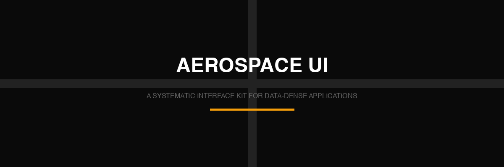
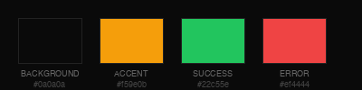
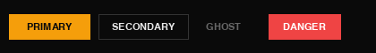
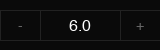
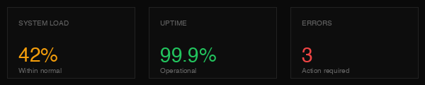
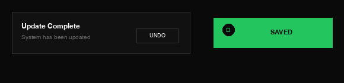

<div align="center">


# AEROSPACE UI

### A systematic interface kit for data-dense applications

[Components](#components) · [Usage](#quick-start--usage) · [Demo](https://skylixone.github.io/aerospace-ui)

<br>



</div>

---

## Design Language

<div align="center">



**Geist Mono** · **Zero Radius** · **Borders Over Shadows**

</div>

---

## Components

### Controls

<div align="center">

**BUTTONS**



`Primary` · `Secondary` · `Ghost` · `Danger`

<br>

**STEPPER**



Numeric adjustment with bounds

</div>

### Data Display

<div align="center">

**METRIC CARDS**



Semantic color coding for KPIs

</div>

### Overlay

<div align="center">

**TOAST NOTIFICATIONS**



Standard toast (left) · Mini toast (right)

</div>

---

## Component Index

<details>
<summary><b>33 Components — Click to view all</b></summary>

| Category | Components |
|----------|------------|
| **Foundation** | Typography · Colors · Spacing |
| **Controls** | Button · Input · Toggle · Checkbox · Radio · Tabs · Stepper Control · **Interactive Steppers** · **Range Sliders** |
| **Data** | Metric Cards · Tables · Bars · Progress · **Adherence Timeline** |
| **Overlay** | Toast · Mini Toast · Modal · Command Palette · Popover · Tooltip · Hover Card |
| **Content** | Panel · Card · Alert · Status (RAG tags) · List · Code Block · Key-Value · Empty State |
| **Layout** | Header · Footer · Skeleton · Divider |

</details>

---

## Current Status (v1)

**Status:** COMPLETE
**Overall Progress:** 95% (v1 Requirements)

### Phase 1: Foundation (Layout & Typography)
- [X] Fixed Sidebar Layout (240px)
- [X] Main Content Area (40px+ padding)
- [X] Labels (0.12em+ letter-spacing)
- [X] Geist Mono weights (300-700)
- [X] Hanging Section Titles

### Phase 2: Components (Data Viz & Monitoring)
- [X] Scorecards (high density)
- [X] Interactive Steppers
- [X] High-density Range Sliders
- [X] Compact Toast System (.toast-mini)
- [X] RAG Status Tags
- [X] Adherence Timeline

### Phase 3: Interactivity/Polishing (Documentation)
- [X] Interactive Demos
- [X] Documentation Links

## To-Dos (v2 Roadmap)
- [ ] Implement Fixed Header Layout (56px)

## Quick Start & Usage

```bash
git clone https://github.com/skylixone/aerospace-ui.git
```

```html
<link href="https://fonts.googleapis.com/css2?family=Geist+Mono:wght@300;400;500;600;700&display=swap" rel="stylesheet">
<link rel="stylesheet" href="aerospace-ui/style.css">
```

To run the local review server and test the components:
```bash
python3 review-server.py index.html --port 8000
```
Then open `http://localhost:8000/` in your browser.

---

## Design Tokens

```css
:root {
  /* Background Layers */
  --bg: #0a0a0a;        /* Deepest layer */
  --bg-raised: #111111; /* Elevated surfaces */
  --bg-surface: #0d0d0d; /* Cards, panels */
  
  /* Accent & Semantic */
  --accent: #f59e0b;    /* Amber primary */
  --green: #22c55e;     /* Success states */
  --red: #ef4444;       /* Error states */
  --blue: #3b82f6;      /* Info states */
  
  /* Typography */
  --font-mono: 'Geist Mono', monospace;
}
```

---

<div align="center">

**[View Live Demo →](https://skylixone.github.io/aerospace-ui)**

<br>


</div>